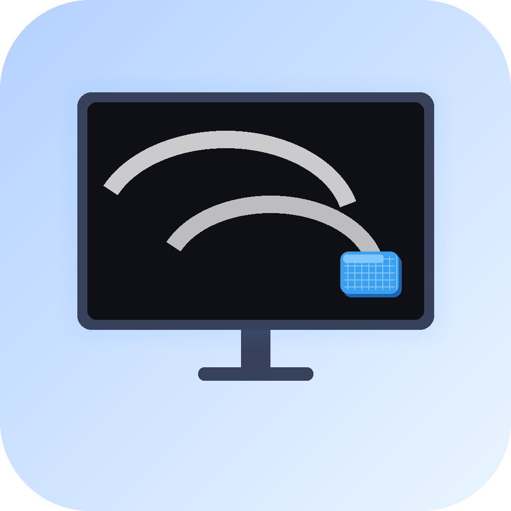

# ScreenCleaner

一个轻量的 macOS 屏幕清洁辅助工具。启动后全屏黑色遮罩，防止擦拭屏幕或键盘时误触操作。



## 功能

- 启动即覆盖所有屏幕（支持多显示器）
- 屏幕中央显示灰色圆形解锁区域，点击退出
- 支持按 F11 直接显示桌面退出
- 轻量无依赖，单文件源码

## 系统要求

- macOS 13+
- Apple Silicon（arm64）

## 使用方式

直接双击 `build/ScreenCleaner.app` 启动，擦拭完成后点击屏幕中央圆形区域退出，或按 F11 显示桌面。

## 从源码构建

需要安装 Xcode Command Line Tools：

```bash
xcode-select --install
```

```bash
git clone <repo>
cd ScreenCleaner
swift build -c release
```

打包为 .app：

```bash
rm -rf build/ScreenCleaner.app
mkdir -p build/ScreenCleaner.app/Contents/MacOS
mkdir -p build/ScreenCleaner.app/Contents/Resources
cp Sources/Info.plist build/ScreenCleaner.app/Contents/
cp icon.icns build/ScreenCleaner.app/Contents/Resources/AppIcon.icns
cp .build/arm64-apple-macosx/release/ScreenCleaner build/ScreenCleaner.app/Contents/MacOS/
```

## 项目结构

```
ScreenCleaner/
├── Sources/
│   ├── main.swift        # 全部源码
│   └── Info.plist        # App bundle 配置
├── Package.swift         # Swift Package 配置
├── build/
│   └── ScreenCleaner.app # 编译好的 App
├── icon.png              # 图标源文件（1024x1024）
├── icon.icns             # App 图标
└── gen_icon.py           # 图标生成脚本（需要 Pillow）
```

## License

MIT
